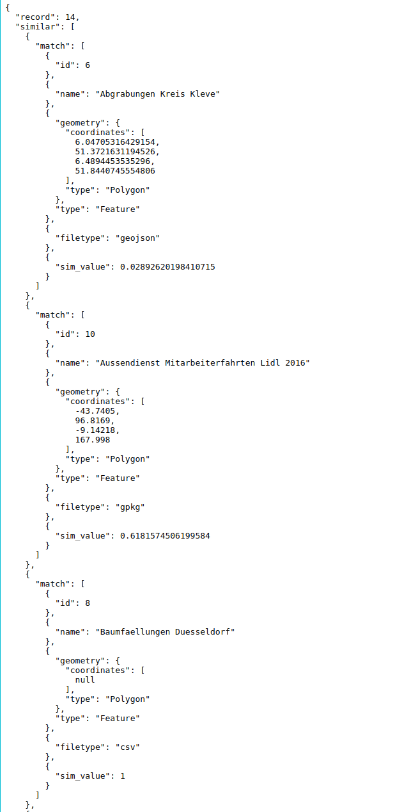

# API Test fuer die zenodo Entwicklungsumgebung

### 1 Testen der records API

http://localhost:5000/api/records/

Diese ist von zenodo vorgegeben, wird aber durch unsere Bereitstellung der Bounding Box ergaenzt.
Standardmaessig werden die letzten 10 gepublishten Records in der API angezeigt. 

http://localhost:5000/api/records/[ID]

Ueber die ID kommt man auf die einzelnen Ansichten der Records.

http://localhost:5000/api/records/[ID]/similar

An diese ID wird dann noch der Suffix similar gehaengt um auf den Similarity endpunkt zu gelangen.

### Tests

__sollten nicht durchgehen:__ 
http://localhost:5000/api/records/[ID]/similar?size  
http://localhost:5000/api/records/[ID]/similar?size=  
http://localhost:5000/api/records/[ID]/similar?size=langweilig  
http://localhost:5000/api/records/[ID]/similar?size=10000  

__sollten durchgehen:__ 
http://localhost:5000/api/records/[ID]/similar?size=0  
http://localhost:5000/api/records/[ID]/similar?size=1  
http://localhost:5000/api/records/[ID]/similar?size=20  